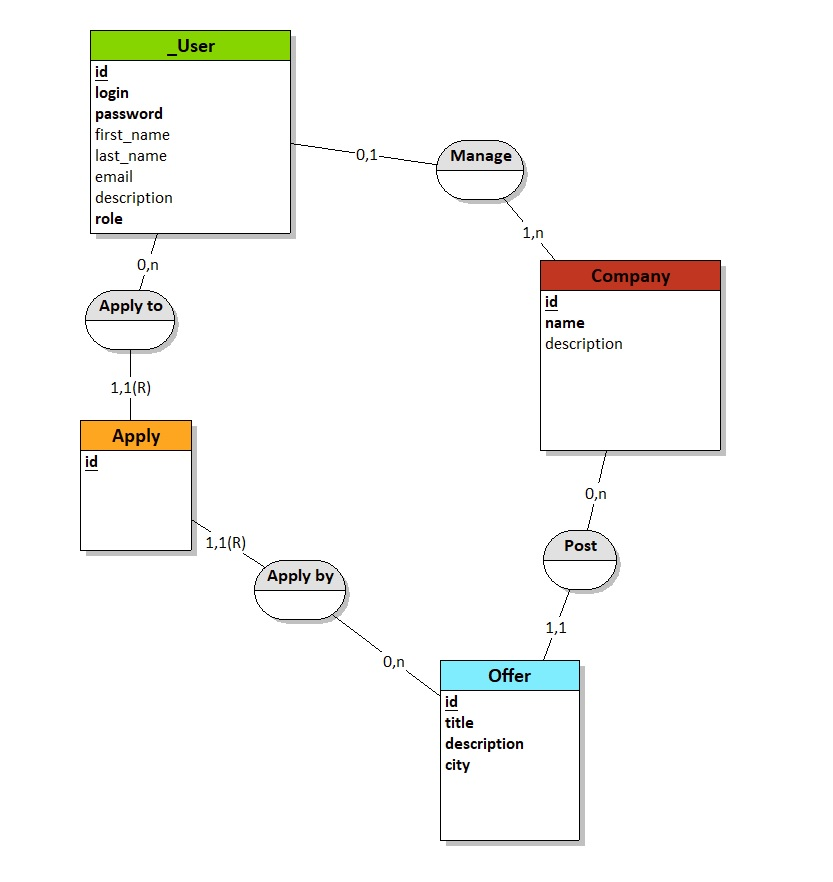
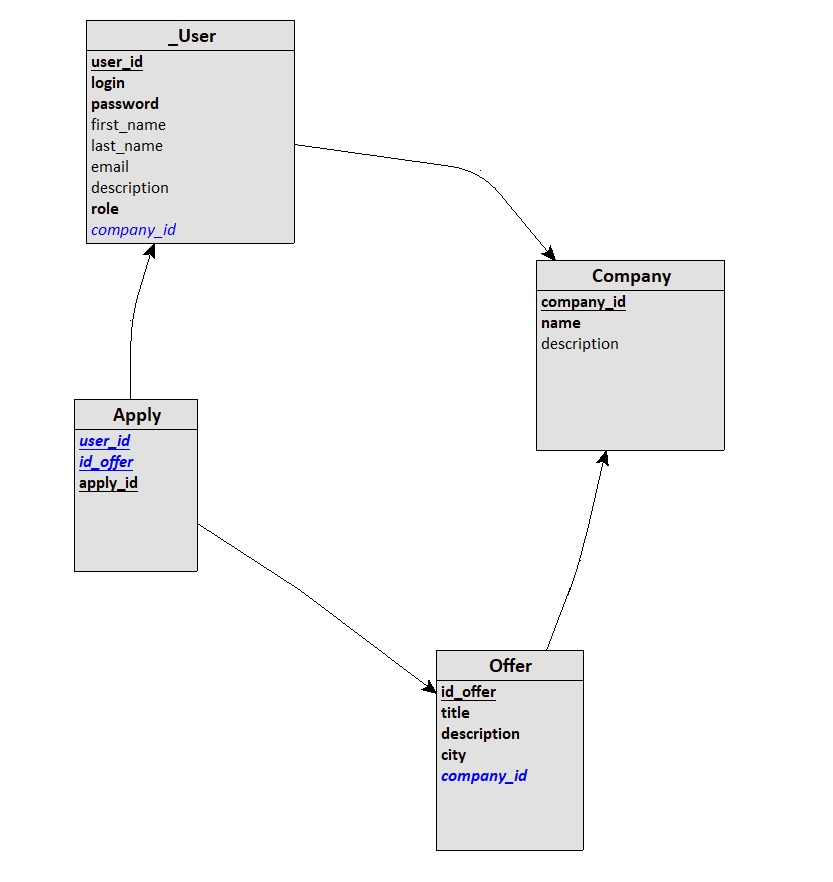
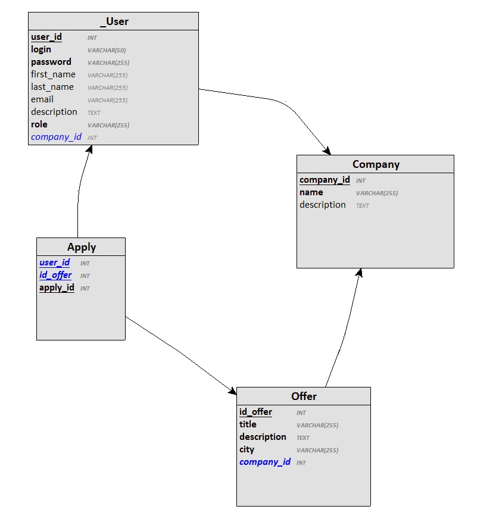

## Partie 3 : Base de données

### Consignes :

Dans cet exercice il s'agira d'abord de modéliser puis de créer la base de données d'un job board.

Un job board est un site internet qui permet aux entreprises de publier des offres d'emploi.

Voici les contraintes de la base de données du job board :

- Un recruteur peut s'enregistrer sur le site
- Une fois enregistré il peut créer une seule entreprise
- Il peut ensuite publier des offres au nom de l'entreprise

- Un candidat peut s'enregistrer sur le site
- Une fois enregistré il peut consulter les offres
- Il peut ensuite candidater à des offres

- Le candidat peut retrouver toutes les entreprises auxquelles il a candidaté
- Le recruteur peut retrouver les informations des candidats qui ont postulé à une offre

Un recruteur a les attributs suivants :

- login
- mot de passe

Un candidat a les attributs suivants :

- login
- mot de passe
- nom
- prénom
- email
- numéro de téléphone
- texte de présentation

Une entreprise a les attributs suivants :

- nom
- description

Une offre a les attributs suivants :

- titre du poste
- descriptif du poste
- ville du poste

### 3.1 Modélisation

Modélise le MPD de la base de données, https://www.dbdesigner.net/ te permettra d'exporter la BDD au format SQLite ce qui te sera utile par la suite.

### 3.2 SQL

Crée la base de données avec SQLite et remplis-la avec des données fictives.

Écris ensuite les requêtes SQL permettant d'obtenir les informations suivantes :

- Toutes les offres d'emploi
- Toutes les offres d'emploi d'une ville (Paris)
- Les informations de tous candidats qui ont postulé à une offre précise
- Les informations de tous les candidats qui ont postulé aux offres d'une entreprise

### Résultat :

Pour la gestion des utilisateurs, j'ai décidé de conserver une entité **User** où les champs d'un candidat (_first_name, last_name, etc.._) sont optionnels et dont les droits sont gérés avec l'ajout d'un champs _role_. Ce champs peut prendre comme valeurs "candidate" ou "recruiter" et non un booléen dans le cas où d'autres rôles seraient ajoutés par la suite.

Il était aussi possible d'avoir deux entités **Candidate** et **Recruiter** distinctes, qui auraient toutes deux héritées d'une entité **User** possédant les propriétés communes (dans ce cas : _login_ et _password_). Toutefois je trouvais qu'il y avait trop peu de matière distincte entre les deux entités et que cela ajoutait de la complexité au niveau des requêtes pour peu de gain.

#### MCD :

#### MLD :

#### MPD :

#### Requêtes SQL :

Toutes les offres d'emploi :

Toutes les offres d'emploi d'une ville (Paris) :

Les informations de tous candidats qui ont postulé à une offre précise :

Les informations de tous les candidats qui ont postulé aux offres d'une entreprise :

